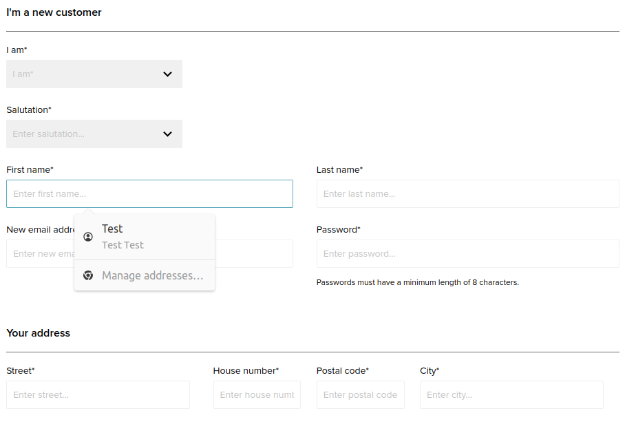
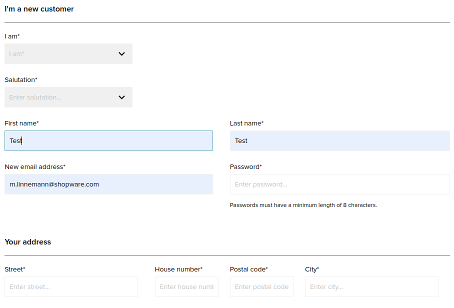
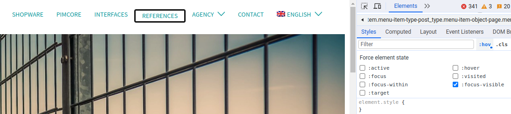
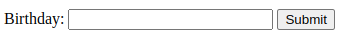
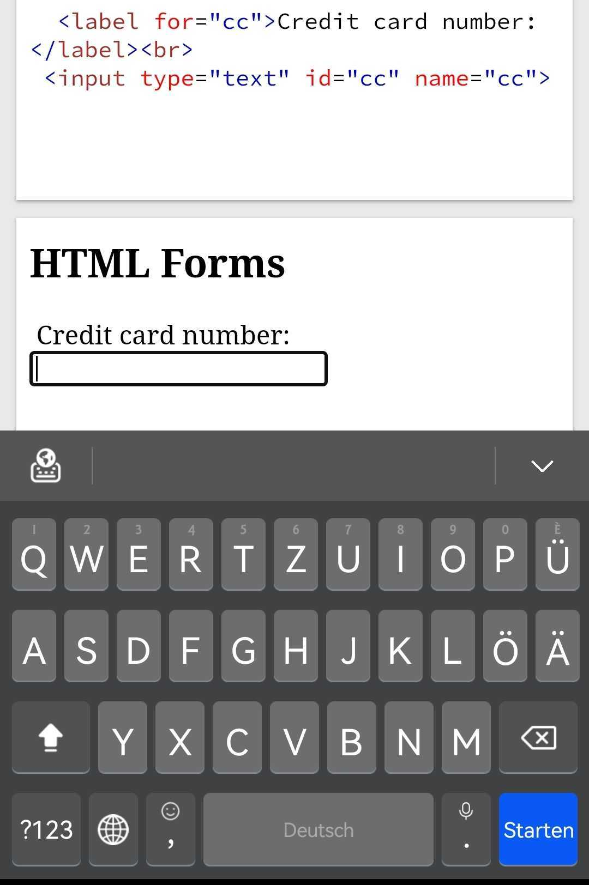
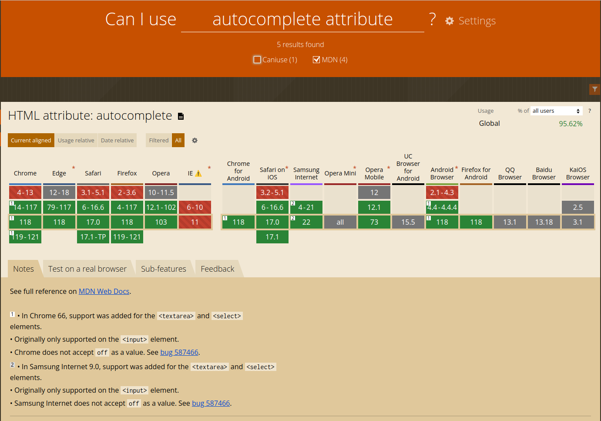
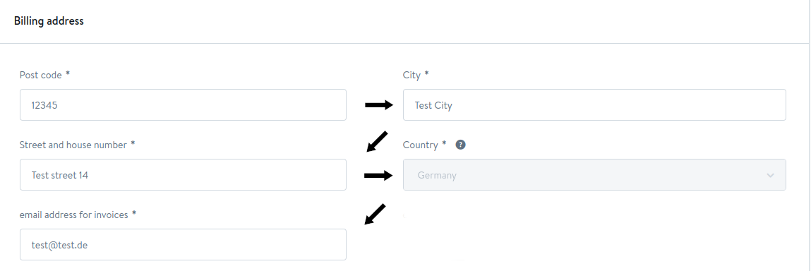

<!-- _class: lead -->
<!-- _footer: "" -->

# Ux Improvements of Forms
## Or: How to get Users annoyed

<!-- Hello everyone, nice that you showed up
- I'm not a native english speaker nontheless the talk will be in english
- spoiler not an accessibility talk there have been other talks with that focus-->

---


# Who am I?

- Martina Linnemann
- Software Engineer in Operations @ shopware AG
- Developer for over 6 years 

---
<!-- _class: lead -->


<!-- 
Imagine your browser has autosaved your address, email address etc., you want to fill in a form and in one field it suggests the correct value and you want to use it but if you click on it it also fills in other fields with a wrong value. Do you feel frustrated?
-->
---



<!-- only visible if adjusted or maybe even not focusable via keyboard navigation -->

---
<!-- _footer: "*Photo by Icons8 Team on Unsplash*" -->


---

# How to annoy users 
- implicit submit (only/not at all)
- keyboard navigation 
  - not working 
  - weird behaviour
- autofilling/autocompletion not working


---

# How to annoy users 

- missing aria attributes 
- using wrong semantics &emsp;&ensp; 
- unknown format for input &nbsp;


<!--
- missing aria attributes & wrong semantics = hell for users of screen readers
- with non supporting browsers-->
---
# How to annoy users
- type != inputmode and inputmode not declared


<!--always remember the next person to be annoyed could be you-->

---


# Why do we annoy them

- lack of awareness
  - issues unknown
  - improvements not always visible 
- mindset 
  - pain points don't affect us
  - one-time use of forms


<!-- therefore repetition of easy improvements can lead to necessary mindset changes -->

---


# Why do we annoy them
- lack of knowledge
- lack of time / priority for improvements
- because we have to 


<!-- - e.g. student, might not know how autocompletion works and what needs to be done for it to work correctly
- have to: story about migration assistant checkboxes and input field to prevent users to finalize it and afterward complain about it not being reversable although it was clearly stated as not reversable-->

---
<!-- _footer: "*Photo by Linda Eller-Shein from Pexels*" -->


---
<!-- _class:  -->
<!-- _footer: "*Photos by Pixabay (left) and Gustavo Fring (middle) from Pexels* &emsp; | &emsp;  &emsp; Martina Linnemann " -->

<!-- - goal 
- personas
- accessibility
 -->


---
<!--_footer: "" -->


---

<!-- _class: lead -->
# Examples

---

<!--_footer: "" -->

 # Hell or heaven?: tabindex 
```html
<form>
    <div class="left-fields">
      <strong>ZipCode</strong>
      <input type="text" tabindex="14">
      <strong>Street</strong>
      <input type="text" tabindex="16">
      <strong>Email</strong>
      <input type="text" tabindex="18">
    </div>
    <div class="right-fields">
      <strong>City</strong>
      <input type="text" tabindex="15">
      <strong>Country</strong>
      <select tabindex="17"></select>
    </div>
</form>
```

<!-- 
- semantics also not good for screenreaders
- often hell, only heaven for small pages (one form) if the default behaviour is counter intuitive-->
---

# Visual Assistance
- are hints needed
- when/how to display errors
- clientside validators


<!-- hints for everything are not helping, sometimes hints underneath an input is better than (only) placeholder
- display errors while typing, after typing or after submitting? are the errors explained? 
- validate the input on the clientside to provide direct feedback -->
---

<!-- class: lead -->
# Autofilling knowledge

---

# Important data for autofilling

- clues through attributes like 
  - name 
  - type 
  - id 
  - formControlName
- autocomplete attribute 
- (recommended to) use label tags

<!-- -clues are checked against some heuristics, that also may differ between browsers, autocomplete (depending on browser compatibibility)
-formControlName is a Angular example, does something like that exist in other frameworks? tell me later -->

---

# Make autofilling possible

```html
<form>
  <label for="companyName">Company Name:</label>
  <input type="text" id="companyName" formControlName="companyName" autocomplete="organization">
  <label for="zipCode">Zip Code:</label>
  <input type="text" name="zipCode" formControlName="zipCode" autocomplete="postal-code">
</form>
```

<!-- to make autofilling possible the best and future proof way is the autocomplete attribute (it is explicit)-->

<!--exact values for autocomplete can be found in the html standard specifications -->

---

# Autofilling software

- browser (built-in)  
- browser extensions 
  - for Chrome e.g. Autofill by tohodo.com
- password manager

 <!-- differences in beahaviour between different browswrs, extensions, password managers-->

---

# Improve autofilling

- :autofill and :-webkit-autofill css pseudoclasses
- set autocomplete to off
- privacy risks with autofilling

<!-- 
- pseudoclasses to make it visible which data was autofilled
- autocomplete to off e.g. for one-time passwords
- privacy risk as a user, do not enable autofilling without needing to explicitly clicking, check if website trustworthy, make sure to not irritate people with form fields not directly visible-->
---

<!-- _footer: "*Photo by Linda Eller-Shein from Pexels*" -->

# How to stop being annoying
- focus visible
- use placeholders
- aria attributes and roles
- inputmode
- Cleave.js (Input formatting library)


<!-- smaller side notes for improvements-->

---

# Prevent bias

- what is bias?
- character support
- choose carefully 
    - street-address instead of address line 1-3


<!--_footer: "*Photo by Markus Winkler from Pexels*" -->

<!--
- bias is when someone or something favors one thing over another, often unfairly  
- support think about names that are not german/english
- the autocomplete attribute value street-address should be used to avoid bias towards western addresses -->    

---

# Key Takeaways
- use your forms like a user
- improvements can be small things
- be not afraid to learn new things
- think about bias

<!-- some improvements are not that obvious if you don't behave like a user, bias not only from ux perspective a big topic-->
---
<!-- _class: lead -->
<!-- _footer: "" -->

# Let's discuss

Martina Linnemann

 

@Martina@phpc.social


@shopwareDevs


